# Kerr geodesics

A numerical integrator for geodesics in Kerr and Schwarzschild spacetime, built
around the Hamiltonian formulation and validated against closed-form results
wherever they exist.

Geometric units throughout: `G = c = 1`, lengths in units of `M`, signature
`(-, +, +, +)`.

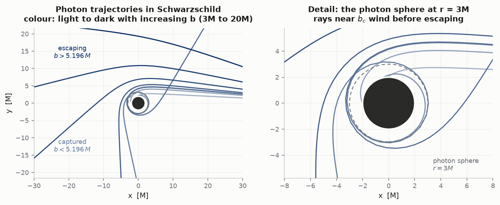

**Status: complete.** All four stages built and validated — Schwarzschild
observables, the Kerr exterior (frame dragging, ergosphere, Lense–Thirring),
the interior in a horizon-penetrating chart (through both horizons to the
ring, the negative-r sheet and the CTC region), and a backwards ray tracer
whose shadow lands on Bardeen's analytic curve to ~4e-4 M. Every stage's
claims are checked against independent closed forms. See [Roadmap](#roadmap).

---

## Quick start

```bash
git clone https://github.com/chngyi/kerr-geodesics
cd kerr-geodesics
python -m venv .venv
```

Activate it — pick the line for your shell:

```bash
source .venv/bin/activate      # macOS / Linux
.venv\Scripts\Activate.ps1     # Windows, PowerShell
.venv\Scripts\activate.bat     # Windows, cmd.exe
```

Then:

```bash
pip install -r requirements.txt

pytest -q                                        # 108 tests, ~4.5 min
python scripts/run_validation.py --md VALIDATION.md   # regenerate the report
python scripts/make_figures.py                   # all 13 figures (~40 min; the
                                                 # ray-traced ones dominate --
                                                 # use --only NAME for one)
```

`run_validation.py` prints to stdout by default; `--md` is what writes the file.
Both `VALIDATION.md` and `figures/` are committed, so you only need to
regenerate them if you have changed the code.

```python
import numpy as np
from kerrgeo import Schwarzschild, trace, photon_from_impact_parameter
from kerrgeo.events import horizon_event, escape_event

bh = Schwarzschild()
y0 = photon_from_impact_parameter(bh, r0=1e4, b=6.0)     # b in units of M
sol = trace(bh, y0, lam_max=5e4,
            events=[horizon_event(bh), escape_event(2e4)])

print(sol.status, sol.r[-1])            # 'event' 20000.0  -- it escaped
```

---

## 1. Formulation: why Hamiltonian, not Christoffel symbols

The textbook geodesic equation is second order,

$$\frac{d^2x^a}{d\lambda^2} = -\Gamma^a{}_{bc}\,\frac{dx^b}{d\lambda}\frac{dx^c}{d\lambda}$$

which you split into 8 first-order ODEs for $(x^a, u^a)$. It works, but for Kerr
it means coding 40 independent Christoffel symbols, each of them a page of
algebra and a place to hide a sign error.

This project uses the equivalent Hamiltonian description. With
$H = \tfrac12 g^{ab}(x)\,p_a p_b$ and $p_a$ the **covariant** momentum,

$$\frac{dx^a}{d\lambda} = g^{ab}p_b, \qquad
\frac{dp_a}{d\lambda} = -\tfrac12\,(\partial_a g^{bc})\,p_b p_c$$

Three advantages, in increasing order of importance:

1. **Only the inverse metric is needed** — five non-zero components for Kerr,
   not forty Christoffels. And the Kerr inverse metric is genuinely simple:

   $$g^{tt} = -\frac{A}{\Sigma\Delta},\quad g^{t\phi} = -\frac{2aMr}{\Sigma\Delta},\quad
   g^{rr} = \frac{\Delta}{\Sigma},\quad g^{\theta\theta} = \frac{1}{\Sigma},\quad
   g^{\phi\phi} = \frac{\Delta - a^2\sin^2\theta}{\Sigma\Delta\sin^2\theta}$$

2. **The norm is the Hamiltonian.** $2H = g^{ab}p_ap_b = -\mu^2$ is conserved
   because $H$ has no explicit $\lambda$-dependence. The four-velocity norm you
   wanted as an error diagnostic is not a separate quantity to track — it *is*
   the conserved Hamiltonian.

3. **$E$ and $L_z$ become exact.** Kerr in Boyer–Lindquist coordinates is
   stationary and axisymmetric, so $g^{ab}$ has no $t$ or $\phi$ dependence, so
   $\partial_t g^{bc} = \partial_\phi g^{bc} = 0$ *identically*. The code for
   $dp_t/d\lambda$ and $dp_\phi/d\lambda$ therefore evaluates to exactly zero,
   and $E = -p_t$, $L_z = p_\phi$ are conserved to machine precision regardless
   of integrator or step size.

Point 3 changes what validation means, and it is worth being precise about:

| quantity | protected by | what its drift means |
|---|---|---|
| $E = -p_t$ | cyclic coordinate $t$ | **a bug.** Measured drift is exactly `0.0`. |
| $L_z = p_\phi$ | cyclic coordinate $\phi$ | **a bug.** Measured drift is exactly `0.0`. |
| $\mu^2 = -g^{ab}p_ap_b$ | conserved $H$ | truncation error, but a weak test |
| **$Q$ (Carter)** | Killing *tensor* — **not** enforced by the code | **the honest truncation-error measure** |

In your N-body code, energy drift measured truncation error. Here it does not:
$E$ and $L_z$ are structurally exact, and if they ever move, tightening the
tolerance will not help because the problem is a coding error. The quantity that
plays the role energy played for you is **Carter's constant**.

### Carter's constant and why Kerr is tractable at all

The two Killing vectors give $E$ and $L_z$; with the norm that is three
constants for a four-dimensional problem, which leaves a genuinely
two-dimensional $(r,\theta)$ system with no closed form. Kerr also admits an
irreducible Killing **tensor**, and the associated fourth constant

$$Q = p_\theta^2 + \cos^2\theta\left[a^2(\mu^2 - E^2) + \frac{L_z^2}{\sin^2\theta}\right]$$

is what separates the Hamilton–Jacobi equation and reduces the motion to
decoupled first-order form. $Q = 0$ is the equatorial plane; $Q > 0$ orbits
oscillate in $\theta$ about the equator.

Because $Q$ comes from a Killing tensor rather than a cyclic coordinate,
nothing in the code forces it to hold — which is exactly what makes it a good
diagnostic.

### The separated form is used as a cross-check, not the workhorse

The separation gives

$$\Sigma\frac{dr}{d\tau} = \pm\sqrt{R(r)},\qquad
\Sigma\frac{d\theta}{d\tau} = \pm\sqrt{\Theta(\theta)}$$

which is much faster — two nontrivial ODEs instead of eight. It is implemented
in [`kerrgeo/separated.py`](kerrgeo/separated.py), but as a second opinion
rather than the main path, for two reasons. The $\pm$ branches must be flipped
by hand at every turning point, exactly where $\sqrt{R}\to 0$ and its derivative
blows up. And more fundamentally, it *assumes* $E$, $L_z$, $Q$ are constant, so
it cannot be validated by checking that they are.

Two implementation notes there. We integrate in **Mino time**
($d\tau = \Sigma\,d\lambda_M$), which removes the shared $1/\Sigma$ and
decouples $r$ from $\theta$ completely. And we differentiate the first-order
equations into second-order form, $d^2r/d\lambda_M^2 = \tfrac12 R'(r)$, which
eliminates the square roots and the branch-flipping entirely — turning points
are then handled automatically, because the trajectory simply decelerates
through them.

**Result:** the two formulations, sharing no code, agree to
`2.4e-6` in every coordinate over 390 M of proper time on a generic inclined
$a = 0.9$ orbit. That is a far stronger statement than either one's internal
diagnostics.

### Exact metric derivatives without hand-derived algebra

`Metric.dginv` uses **complex-step differentiation**:

$$f'(x) = \frac{\mathrm{Im}\,[\,f(x + ih)\,]}{h} + O(h^2)$$

Because the derivative is recovered from the *imaginary* part there is no
subtractive cancellation, so $h$ can be taken absurdly small (we use `1e-20`)
and the $O(h^2)$ truncation error vanishes. The result is correct to full double
precision — effectively an exact derivative, without hand-deriving ten messy
quotient-rule expressions per metric.

The price: every metric must be written using only analytic operations (no
`abs`, no branching on coordinate values). That constraint is documented on
`Metric.ginv`, and a unit test checks the complex-step result against a central
difference.

---

## 2. Integrator choice

**Short answer: adaptive DOP853 by default; RK4 for bulk ray tracing;
Gauss–Legendre when you want to claim something about long-term orbits.**

### Your leapfrog reflex will not work here

The natural instinct — "use velocity Verlet like a good N-body person" — fails.
Leapfrog and friends need a **separable** Hamiltonian, $H = T(p) + V(x)$, so
each half-step can be solved exactly. Ours is $H = \tfrac12 g^{ab}(x)p_ap_b$:
quadratic in $p$, but with position-dependent coefficients. There is no exact
drift/kick split. This rules out the entire family of explicit symplectic
methods you would reach for first.

### Whether RK4's drift actually matters depends on what you compute

| task | secular drift matters? | recommendation |
|---|---|---|
| Deflection, capture, ray tracing | No — single pass, nothing accumulates | **RK4** is fine and fastest |
| Precession over hundreds of orbits | **Yes**, and worse than it looks | DOP853 or GL2 |
| Long-term bound orbits, inspirals | Yes | **GL2** (symplectic) |

The precession case deserves the warning: a spurious secular change in $E$ or
$L_z$ would masquerade as *extra precession* — the numerical error contaminates
precisely the quantity being measured. (In this code that particular failure is
structurally impossible, since $E$ and $L_z$ are exact. But the trajectory error
is not.)

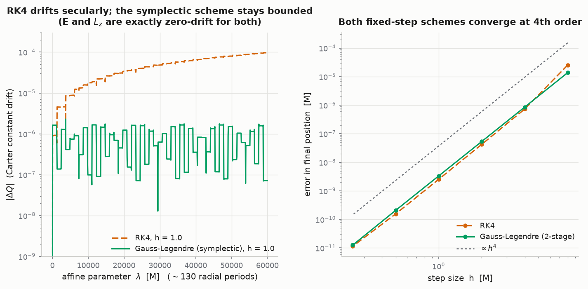

The left panel is the direct measurement. Over a few orbits the schemes are
indistinguishable; over ~130 radial periods, RK4's Carter-constant error climbs
steadily from `1e-6` to `1e-4` while the symplectic scheme's stays bounded and
merely oscillates. That is the whole practical difference between symplectic and
non-symplectic, and it is why the honest answer is "it depends on the task"
rather than "always use X".

### Why adaptive stepping, for a reason unrelated to accuracy

Near periapsis and near the photon sphere the coordinate velocity varies by
orders of magnitude along a single trajectory. Any fixed step is simultaneously
wasteful far out and inadequate close in. DOP853 at `rtol = 1e-12` holds the
Carter constant to `1.8e-11` over 3000 M — three to four orders of magnitude
better than fixed-step RK4 at `h = 0.5`, for comparable cost.

### Available integrators

| method | order | properties | use for |
|---|---|---|---|
| `RK4` | 4 | explicit, fixed step | ray tracing, speed |
| `DOP853` | 8 | explicit, adaptive | **default** |
| `GL2` / `GL3` | 4 / 6 | implicit, **symplectic** | long-term bound orbits |

`GL2`/`GL3` are Gauss–Legendre implicit Runge–Kutta, solved by fixed-point
iteration. Unlike leapfrog they work for a general non-separable $H$. They also
conserve quadratic first integrals exactly — which means the norm
$g^{ab}p_ap_b$ holds to machine precision *by construction*. Worth knowing when
reading the diagnostics: it makes the norm look flattering relative to the
actual trajectory error, which is one more reason to watch $Q$ instead.

---

## 3. Validation

Full numbers in [`VALIDATION.md`](VALIDATION.md), regenerated by
`scripts/run_validation.py`. 60 tests in `tests/test_kerrgeo.py`.

The strategy is to compare against things that **share no code with the
integrator** — closed forms, independent quadratures, and a second formulation.
Self-reported conservation is necessary but nowhere near sufficient.

### Closed-form landmarks (exact)

Horizon $r_\pm = M \pm\sqrt{M^2-a^2}$; photon sphere $3M$; ISCO $6M$; critical
impact parameter $b_c = 3\sqrt{3}M$; ergosphere $r_E = M + \sqrt{M^2 - a^2\cos^2\theta}$.
For extremal $a = M$: horizon, prograde ISCO and prograde photon orbit all
collapse to $r = M$, retrograde ISCO is $9M$, retrograde photon orbit is $4M$.
All reproduced to `0.00e+00`.

### Light deflection

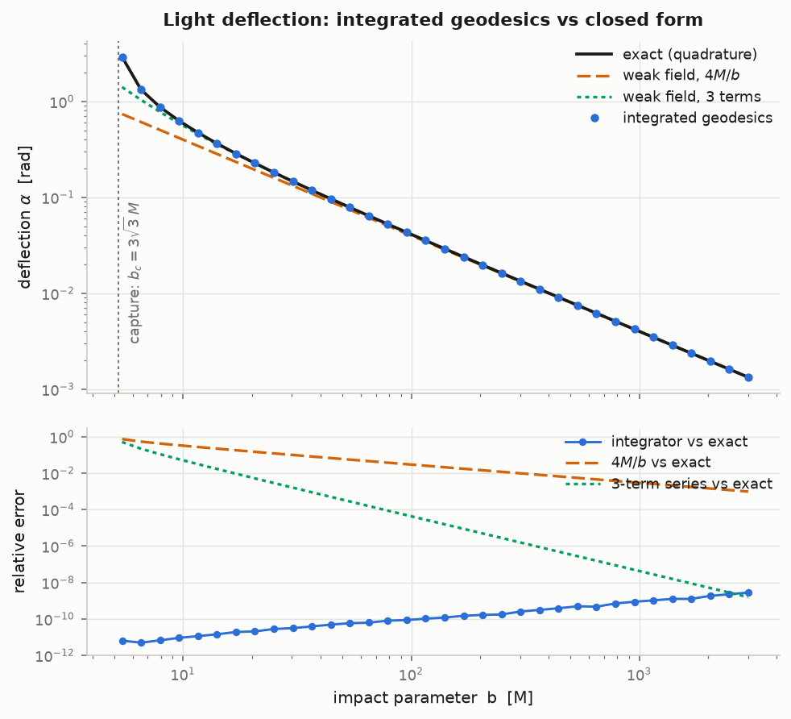

The integrated geodesics track the exact quadrature to **1e-12 to 1e-10
relative across three decades** of impact parameter — while over the same range
the first-order Einstein formula $4M/b$ is off by 20% at $b = 6M$ and the
three-term series by `1e-3`.

Two checks here are sharper than they look:

- **The second-order coefficient.** $4M/b$ alone is recovered by almost any
  roughly-correct calculation. Isolating the next term from the integrated
  result gives `11.78205` against $15\pi/4 = 11.78097$ — a relative error of
  `9.1e-5`, which is the size of the *fourth*-order term we did not subtract.
  That coefficient is sensitive to the actual spatial curvature of the metric.
- **The capture threshold by bisection.** Bisecting on "does this photon reach
  the horizon" gives `5.196152423`, matching $3\sqrt{3}$ to `6.5e-11`. This is a
  genuinely strong-field quantity obtained by integration, not by formula.

A note on method: extracting the deflection by subtracting initial and final
$\phi$ carries an $O(b/r_0)$ error that would swamp the second-order term. We
read off the *direction of travel* at each end instead, which converges as
$O(M\log r/r)$ with no $O(b/r)$ term at all. See `measure.measure_deflection`.

### Perihelion precession

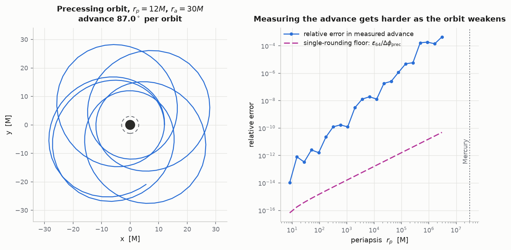

Against an exact quadrature of the orbit equation: `1.6e-13` at $r_p = 10M$,
`5.7e-12` at $r_p = 100M$.

**Mercury: an honest negative result.** The weak-field formula
$6\pi GM/c^2a(1-e^2)$ gives **42.981 arcsec/century** against the observed
42.98. But *integrating the geodesic* gives 42.55 — about 1%, and it does not
improve as `rtol` is tightened.

This is a precision limit, not an integrator failure, and it is worth
understanding because it is the kind of thing that looks like a bug. Mercury's
advance is `5.02e-7` rad against a swept $2\pi$: measuring it by subtraction
throws away seven significant figures, leaving ~9 digits of a 16-digit float.
The right panel shows the error growing smoothly with orbit size, tracking about
two decades above the single-rounding floor (the gap is accumulation over many
steps). The fix, if you want one, is extended precision (`mpmath`) — not a
better integrator.

The *analytic* path avoids this by folding the $-2\pi$ inside the integrand, so
the small quantity is computed directly rather than as a difference of large
ones. That trick is not available to the measurement, because $\phi$ comes out
of the integrator as a single accumulated number.

### Two independent formulations

Hamiltonian vs separated Carter equations, generic inclined $a = 0.9$ orbit
($E = 0.95$, $L_z = 2.8$, $Q = 3$), compared over 390 M of proper time:

| coordinate | max deviation |
|---|---|
| $r$ | `2.4e-6` |
| $\theta$ | `1.8e-6` |
| $\phi$ | `2.3e-6` |
| $t$ | `2.1e-6` |

### Other checks worth having

- **Time reversibility** — integrate forward then back: `8.0e-13`. This catches
  a class of bug the invariants cannot see, because a geodesic can sit at
  completely the wrong place on the right orbit and still report perfect $E$,
  $L_z$ and $Q$.
- **Convergence order** — halving $h$ cuts the error by ~16 for both fixed-step
  schemes, confirming they are the order they claim to be. (Measure this at
  coarse steps: at $h = 0.2$ RK4 is already on the round-off floor, where the
  ratio is meaningless.)
- **Circular orbits stay circular** — peak-to-peak $r$ over 2000 M: `1.3e-11`.
- **Forbidden initial conditions raise** rather than silently producing NaN
  trajectories, with a message saying which of $R(r)$ or $\Theta(\theta)$ went
  negative.

---

## 4. Stage 2: the Kerr physics

Same machinery, spin turned on. Every result below is an integrated
measurement checked against an independent closed form — Bardeen's photon-orbit
constants, the Wilkins orbital frequencies, the frame-drag rate.

### Frame dragging, measured three ways

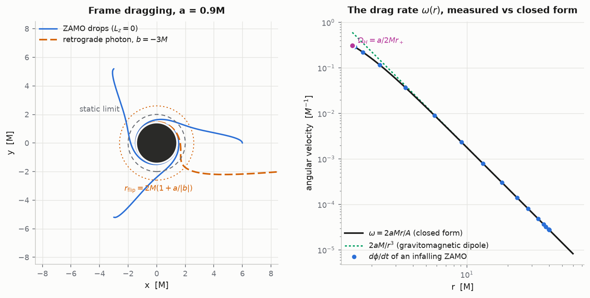

- **A particle with zero angular momentum orbits anyway.** Drop a particle with
  $L_z = 0$ — no angular momentum, no torque ever acts on it — and it spirals
  prograde as it falls (left panel), because its azimuthal rate is pinned to
  the frame-drag rate: $d\phi/dt = \omega(r) = 2aMr/A$ identically. The
  integrated trajectory matches the closed form to `5.6e-17` (right panel),
  and at the horizon everything crosses corotating at
  $\Omega_H = a/2Mr_+$ (matched to `1.8e-6`, limited only by the $\epsilon$
  cutoff). The ZAMO winds up 13.5 rad — over two full turns — before crossing.
- **Light aimed backwards is turned around.** A captured retrograde photon's
  azimuthal motion reverses at exactly

  $$r_{\rm flip} = 2M\left(1 + \frac{a}{|b|}\right)$$

  measured to `2e-15`. Note $r_{\rm flip} > 2M$: the photon is reversed
  *outside* the static limit. The ergosphere statement — no observer can stay
  non-rotating — is about timelike worldlines; a photon's $\phi$-motion is
  softer and flips earlier.

### The prograde/retrograde asymmetry

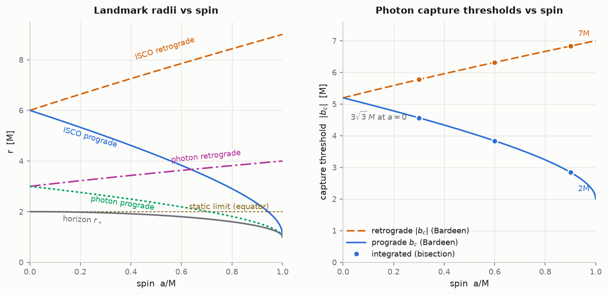

Spin splits every landmark in two. At $a = 0.9M$ the capture thresholds are

| | prograde | retrograde |
|---|---:|---:|
| $\|b_c\|$ measured (bisection) | `2.8444217` | `6.8323196` |
| $\|b_c\|$ Bardeen closed form | `2.8444214` | `6.8323192` |

— a factor 2.4 asymmetry, reaching $2M$ vs $7M$ (3.5×) at extremality. The
same $|b| = 7M$ ray bends 0.81 rad prograde but 2.59 rad retrograde: the hole
is effectively much bigger for light that fights the spin. (At $a = 0$ the two
directions agree to `1e-10` — a reflection-symmetry control the tests enforce.)

### Spherical photon orbits

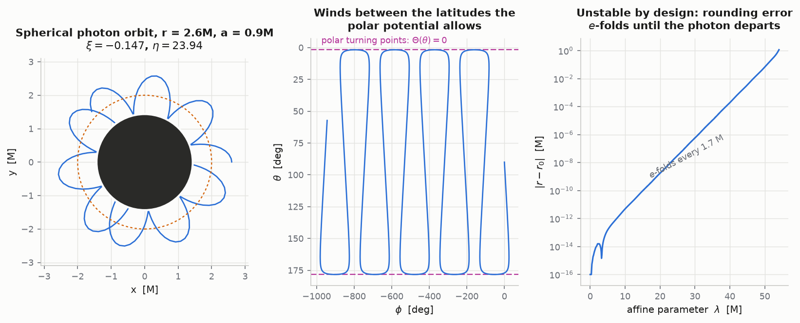

Kerr has photon orbits at constant $r$ for a whole *range* of radii — the 3D
generalisation of the photon sphere, and the skeleton of the black-hole
shadow. The builder takes $(\xi, \eta)$ from Bardeen's $R = R' = 0$ conditions
(verified to `1e-10` across the allowed range) and the integrated orbit holds
$r$ to `1.7e-9` over 20 M — then departs, e-folding every **1.7 M**, because
these orbits are unstable *by construction*. Both halves are physics: the hold
validates the integrator, and the measured instability is the mechanism that
makes these orbits the shadow edge.

### Two precessions, one set of frequencies

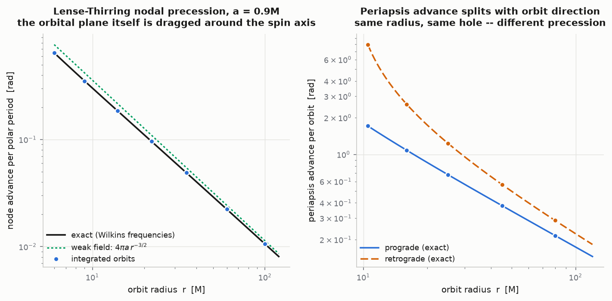

The Wilkins frequencies $\Omega_\phi, \Omega_\theta, \Omega_r$ of circular
orbits split pairwise with spin, and each splitting is measured:

- $\Omega_\phi = \sqrt{M}/(r^{3/2} \pm a\sqrt{M})$ — Kepler's third law with a
  spin correction — matched to `5e-15` by timing one integrated revolution.
- **Lense–Thirring nodal precession** ($\Omega_\phi \ne \Omega_\theta$): the
  orbital plane of an inclined orbit is dragged around the spin axis. Measured
  from $\phi$ between successive ascending nodes of an exactly spherical
  inclined orbit: matches to `8e-10`, with the $a = 0$ control giving ratio 1
  (planes fixed without spin). This is the effect Gravity Probe B measured
  around Earth — here at $10^{11}$ times the strength.
- **Periapsis advance** ($\Omega_\phi \ne \Omega_r$): matches
  $2\pi(\Omega_\phi/\Omega_r - 1)$ to the $O(e^2)$ accuracy of the
  near-circular formula, and splits strongly with direction — at $r = 10M$,
  1.81 rad/orbit prograde vs 10.05 retrograde.

### Energetics: the ergosphere does real work

Two results that set up stage 3:

- **Negative-energy orbits exist, and only inside the ergosphere.** For
  $E = -0.1$, $L_z = -3$ at $a = 0.9$ the radial potential is positive in a
  band inside the static limit and negative everywhere outside: a
  negative-energy fragment is causally committed to the hole. That is the
  Penrose process in potential form — drop in, split, and the piece that
  escapes carries out more energy than went in.
- **The ISCO binding-energy ladder.** $1 - E_{\rm isco}$: 5.72%
  (Schwarzschild), 15.6% ($a=0.9$), 32.1% ($a=0.998$, Thorne's
  spin-equilibrium limit), climbing toward $1 - 1/\sqrt{3} = 42.3\%$ at
  extremality. This is why accretion onto a spinning hole outshines nuclear
  fusion by an order of magnitude.

---

## 5. Coordinate singularities at the horizons

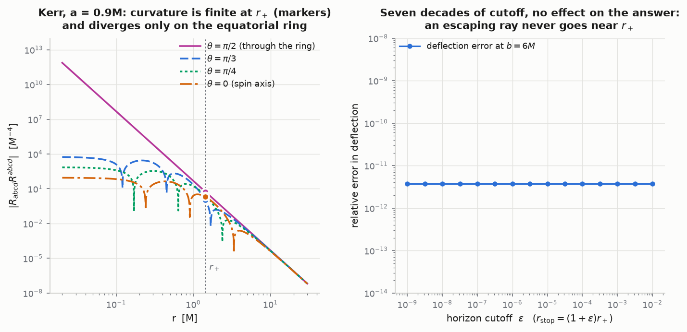

$\Delta = r^2 - 2Mr + a^2$ vanishes at $r_\pm$, making $g^{tt}$ and $g^{t\phi}$
blow up like $1/\Delta$. **Nothing physical happens there.** The left panel
shows the Kretschmann scalar $R_{abcd}R^{abcd}$ is perfectly finite at $r_+$
(markers) — it is the chart that fails, because Boyer–Lindquist $t$ is the time
of a distant static observer, and that observer never sees anything cross.

The same panel shows what *is* singular: only the $\theta = \pi/2$ curve
diverges as $r \to 0$. The singularity is a **ring** in the equatorial plane,
and off-equatorial worldlines pass the origin with finite curvature.

### The practical handling, and why it is enough

Because we integrate in an **affine parameter rather than $t$**, the trajectory
stays smooth all the way down to $r_+$; only $dt/d\lambda$ diverges. This is the
main reason to parametrise by $\lambda$: it converts a stiff problem into a
benign one. So the correct handling for all exterior work is simply to stop —
a terminal event at $(1+\epsilon)r_+$, labelling the geodesic "captured".
Nothing that reaches the horizon comes back, so no exterior physics is lost. For
ray tracing, captured = black pixel.

The right panel is the evidence that this is harmless: varying $\epsilon$ over
**seven decades** ($10^{-9}$ to $10^{-2}$) changes the deflection at $b = 6M$ by
exactly `0`. An escaping ray never goes near $r_+$, so the cutoff is invisible
to it.

### Stage 3 needs a different chart — plan for it now

The interior region and the closed timelike curves near the ring are **not
reachable this way**. You cannot integrate *through* $r_+$ in Boyer–Lindquist
coordinates at any tolerance, because the chart genuinely does not cover the
crossing. That needs a horizon-penetrating chart — ingoing Kerr / Kerr–Schild,

$$dv = dt + \frac{r^2+a^2}{\Delta}dr, \qquad
d\tilde\phi = d\phi + \frac{a}{\Delta}dr$$

in which $g = \eta + f\,l\,l$ is regular at both horizons. It is also the only
way to reach $r < 0$ through the ring, which is where the CTC region
$g_{\phi\phi} < 0$ actually lives.

This is why `Metric` is an abstract, pluggable object rather than hard-coded BL:
**stage 3 is a new metric subclass, not a rewrite.** Implement `ginv` with
analytic operations, declare which coordinates are cyclic, and everything
else — integrators, events, invariants, diagnostics — works unchanged. The
next section is that subclass in action.

---

## 6. Stage 3: through the horizons into the interior

The promised chart is [`KerrIngoing`](kerrgeo/metrics/kerr_schild.py) — Kerr in
ingoing Kerr coordinates, defined by relabelling time along infalling light:

$$dv = dt + \frac{r^2+a^2}{\Delta}dr, \qquad d\tilde\phi = d\phi + \frac{a}{\Delta}dr$$

Transforming the BL inverse metric, **every $1/\Delta$ cancels algebraically**
(the derivation is worked in the module docstring), leaving

$$g^{vv} = \frac{a^2\sin^2\theta}{\Sigma},\quad
g^{vr} = \frac{r^2+a^2}{\Sigma},\quad
g^{v\tilde\phi} = g^{r\tilde\phi} = \frac{a}{\Sigma},\quad
g^{rr} = \frac{\Delta}{\Sigma},\quad
g^{\theta\theta} = \frac{1}{\Sigma},\quad
g^{\tilde\phi\tilde\phi} = \frac{1}{\Sigma\sin^2\theta}$$

— *simpler* than Boyer–Lindquist, regular at both horizons, and valid for
$r < 0$. Because the relabelling only mixes $t, \phi$ with functions of $r$,
the Killing vectors are unchanged: $E$, $L_z$, and Carter's $Q$ keep their
values and their formulas, and every diagnostic works verbatim. The two charts
agree on a shared geodesic to **2e-13 in all eight phase-space components**
in the exterior overlap.

One numerical lesson repeats from stage 1: the ingoing radial momentum is
$p_r = (P - \sqrt{R})/\Delta$, which cancels catastrophically near the
horizon. The conjugate form $p_r = K/(P + \sqrt{R})$ is algebraically
identical and manifestly finite everywhere — same disease, same cure, as the
periapsis initial conditions.

### Crossing

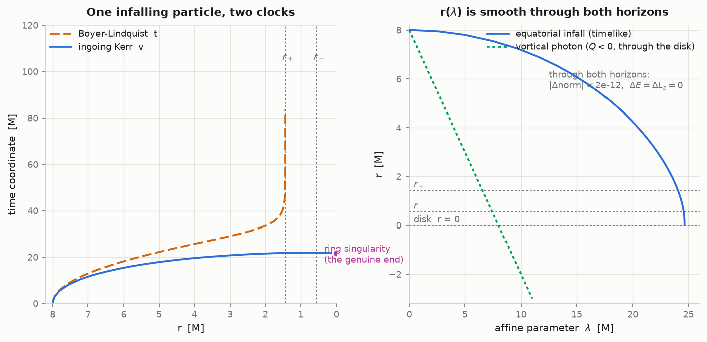

The same infalling particle, two clocks: BL $t$ diverges at $r_+$ (left, the
chart running out of numbers), while ingoing $v$ passes through $r_+$ **and**
$r_-$ and only ends on the ring. Through both crossings the norm drifts by
`6e-12` and $E$, $L_z$ by exactly zero; the whole 200 M trajectory costs
~3000 RHS evaluations — crossing horizons in the right chart is numerically
*unremarkable*, which is the point.

The sharpest test is an exact solution: in this chart the ingoing principal
null rays are $r = r_0 - \lambda$ at constant $(v, \theta, \tilde\phi)$ —
straight coordinate lines through $r_+$, $r_-$, and the disk. The integrator
reproduces this to **3e-13 over the whole passage** into the negative-r sheet.

Two facts about who gets in and how far, both checked:

- $R(r{=}0) = -a^2 Q$, so **crossing the disk into $r<0$ requires $Q < 0$** —
  the "vortical" geodesics confined to cones about the axis (the principal
  rays have $Q = -a^2\cos^4\theta_0$, verified). Anything with
  equator-crossing polar motion bounces or dies on the ring.
- A particle with an inner turning point turns around below $r_-$, becomes
  outgoing — and stalls at the Cauchy horizon from below: the *ingoing* chart
  covers infalling crossings only, and $v$ diverges for outgoing ones exactly
  as BL $t$ did at $r_+$. Continuing that worldline needs an outgoing
  extension (a different universe in the maximal diagram). The chart tells
  you its own limits, in the same language as before.

### The closed timelike curves

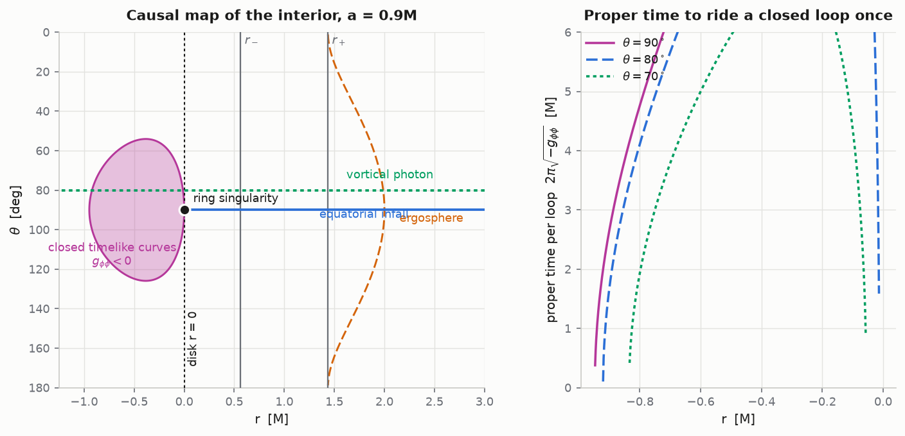

The causal endpoint of the project. The azimuthal circles — closed by
$\tilde\phi$'s periodicity — are timelike where $g_{\tilde\phi\tilde\phi} < 0$,
and the map shows exactly where that happens: a lobe **hugging the ring on the
negative-r sheet**, equatorial band $r \in [-0.947, -0.001]$ at $a = 0.9$,
with the inner edge matching the real root of $r^3 + a^2r + 2a^2M = 0$. On the
entire $r > 0$ sheet, $g_{\phi\phi} > 0$ everywhere (grid-verified): the
exterior is causally clean, and the pathology hides behind both horizons *and*
the disk.

Riding a loop at $r = -0.5$ on the equator returns you to the same event —
same $v$, same everything — after **9.3 M of proper time** (for a solar-mass
hole, ~46 μs of aging per loop into your own past). These circles are
accelerated worldlines, not geodesics; but geodesics do *traverse* the region:
the vortical ray at $\theta_0 = 80°$ passes straight through the CTC band and
out into the negative-r asymptotic domain.

Worth saying plainly: none of this is reachable from outside. The CTC region
is behind the Cauchy horizon, where strong-cosmic-censorship arguments (mass
inflation — the blueshift instability of $r_-$ itself) suggest the idealised
Kerr interior is not what a real collapse produces. What the integrator
explores is the maximally extended *vacuum* solution, on its own terms.

---

## 7. Stage 4: what it looks like

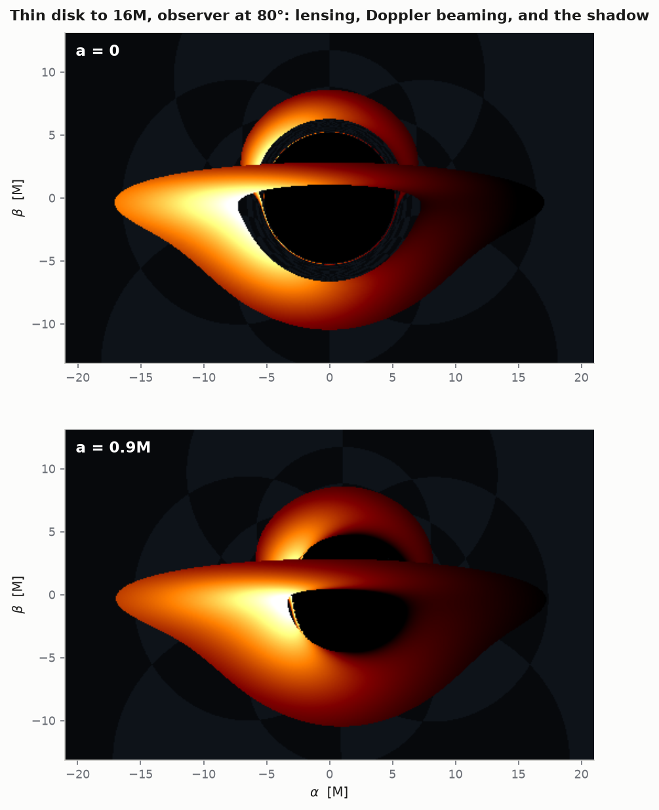

Backwards ray tracing: each camera pixel's photon is integrated *away* from
the camera, and the pixel shows wherever the ray came from — the horizon
(black: the shadow), the thin disk (Doppler-shifted disk material), or the
background sky (a checkered celestial sphere, so the lensing is visible). The
upper panel is
Schwarzschild; the lower is $a = 0.9M$ — the shadow shifts sideways off the
spin axis, the disk's approaching side beams up by $(g_{app}/g_{rec})^4 \sim
8\times$ at $r = 6M$ (more further in), and the "hair band" over the shadow is
the disk's *far side*,
lensed over the top of the hole. Secondary images of the disk appear under
the shadow the same way. None of this is styled in; it all falls out of the
geodesics.

### The engine

An image is $10^4$–$10^5$ rays, so [`kerrgeo/render.py`](kerrgeo/render.py)
integrates them **as one batch**: the state is an (8, N) array, RK4 stages
are numpy expressions over all rays at once, each ray carries its own step
$h \propto r$, and finished rays freeze. The committed frames (480×300, fine
steps plus a refinement pass on near-shell rays) take ~10 minutes each; a
quick look at default settings is about ten times faster — this is the
workload RK4 was benchmarked for back in stage 1.

The batch RHS necessarily restates the BL metric as array formulas.
Duplicated physics is a bug farm, so the first stage-4 test pins it against
`kerrgeo.rhs` on random states (`9e-16`), and the camera is built from
conserved quantities — Bardeen's $(\alpha, \beta) \to (\xi, \eta)$ map — so
each pixel is just `state_from_constants` with $E = 1$.

Two numerical lessons earned here, both documented in the module:

- **An RK4 step is not a point evaluation.** Near $r_+$ the BL metric
  diverges, and a step whose *stages* sample the divergent zone catapults a
  plunging ray to $|r| \sim 10^5$ — in either direction, including outward
  past the escape radius, silently misclassifying a captured ray. The fix is
  a geometric approach to the capture buffer (no stage can reach the
  divergence) plus an escape test that a one-step teleport cannot satisfy.
- **Metrology and imaging want different integrators.** Near-critical rays
  wind along the photon shell, whose instability e-folds integrator error
  (the stage-2 measurement, now working against us): fixed-step RK4 leaves
  hairline annuli of misclassified pixels near the shadow edge *no matter
  the step size*, and bisection will lock onto one. So the images use the
  fast batch tracer, while the boundary **measurement** uses per-ray DOP853 —
  adaptivity keeps the trajectory error ~rtol regardless of winding, making
  the misclassified annulus ~$10^{-9} M$ wide.

### The shadow against Bardeen

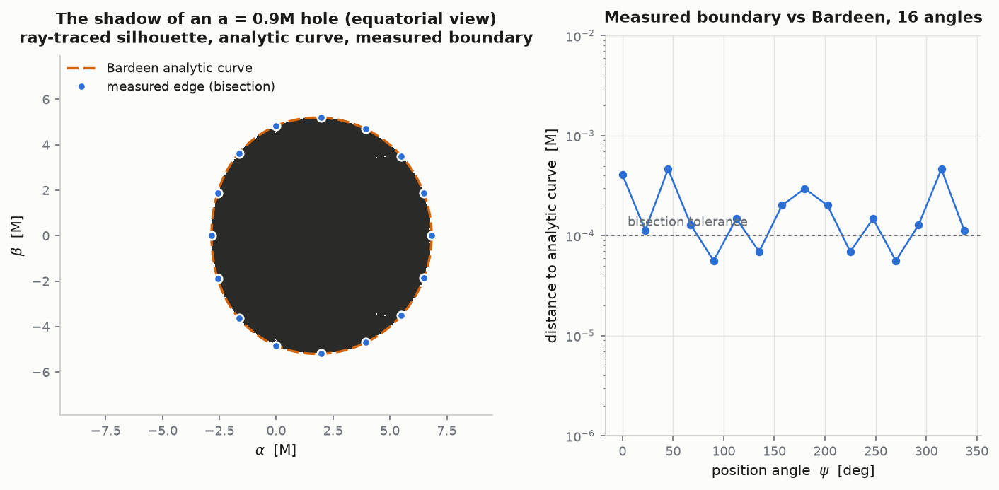

The stage-4 validation number: the shadow boundary, measured by radial
bisection on integrated rays at 16 position angles, lands on Bardeen's
analytic curve to **max 4.6e-4 M at 90° inclination and 3.4e-4 M at 60°** —
the bisection tolerance — and the $a = 0$ shadow is a circle of radius
`5.196129` vs $3\sqrt{3} = 5.196152$, round to $10^{-4}$. The analytic curve
enters the measurement only as a ±30% bracket seed, so agreement is earned,
not assumed. (Getting the *reference* right took care too: near its $\beta=0$
tips the curve scales as $\sqrt{r - r_{tip}}$, and uniformly-sampled
polylines fall short of the true capture thresholds by 0.015M — the library
now solves for the tips and clusters nodes there.)

---

## Layout

```
kerrgeo/
  metrics/base.py     Metric ABC; complex-step derivatives; cyclic-coordinate handling
  metrics/kerr.py     Kerr in Boyer-Lindquist (a=0 gives Schwarzschild)
  metrics/kerr_schild.py  ingoing Kerr chart: horizons, interior, r<0, CTCs;
                      BL <-> ingoing transfer; exact principal null rays
  hamiltonian.py      Hamilton's equations; building initial conditions
  invariants.py       norm, E, Lz, Carter Q; drift reporting
  integrate.py        RK4, DOP853, Gauss-Legendre symplectic; Solution type
  events.py           horizon / escape / turning-point / equator-crossing events
  separated.py        Carter first-order form, as an independent cross-check
  measure.py          deflection, precession, capture threshold, reversibility
  analytic.py         closed forms and exact quadratures to validate against
  render.py           batch ray tracer, pixel camera, shadow bisection, disk shading
scripts/
  run_validation.py   quantitative report -> VALIDATION.md
  make_figures.py     the 13 figures in figures/  (--only name to regenerate one)
  style.py            plotting style; CVD-checked palette
tests/
  test_kerrgeo.py     60 tests: machinery, conservation, Schwarzschild observables
  test_kerr_stage2.py 22 tests: Kerr physics vs closed forms
  test_kerr_stage3.py 15 tests: chart agreement, horizon crossing, interior, CTCs
  test_kerr_stage4.py 11 tests: batch-tracer honesty, shadow vs Bardeen, Doppler
```

Schwarzschild is deliberately *not* a separate implementation — it is
`KerrBL(a=0)`. Sharing the code path means the Schwarzschild validation suite,
which has many exact answers to check against, is simultaneously a test of the
Kerr code, where far fewer closed forms exist.

## Roadmap

- [x] **Stage 1 — Schwarzschild.** Deflection, photon sphere, capture threshold,
      precession. Validated.
- [x] **Stage 2 — Kerr physics.** Frame dragging (ZAMO corotation, photon
      $\phi$-reversal), capture-threshold asymmetry vs Bardeen, spherical
      photon orbits and their instability, Lense–Thirring nodal precession,
      negative-energy states in the ergosphere. Validated.
- [x] **Stage 3 — Interior.** Ingoing Kerr chart regular at both horizons;
      BL/ingoing agreement to 2e-13; exact principal-null-ray test through
      to $r<0$; CTC region mapped and traversed; Cauchy-horizon stall
      behaviour pinned. Validated.
- [x] **Stage 4 — Backwards ray tracing.** Vectorised batch tracer (~10^5
      rays); shadow boundary matches Bardeen to ~4e-4 M at two inclinations;
      a = 0 shadow round to 1e-4; Doppler-beamed disk render. Validated.

## References

- Carter, *Global structure of the Kerr family of gravitational fields*, Phys. Rev. **174** (1968) 1559 — the separation and the fourth constant.
- Bardeen, Press & Teukolsky, ApJ **178** (1972) 347 — ISCO, photon orbits, circular-orbit $E$ and $L_z$.
- Bardeen, in *Black Holes* (Les Houches, 1973) — the analytic shadow outline and the photon-orbit constants $(\xi, \eta)$.
- Wilkins, Phys. Rev. D **5** (1972) 814 — orbital frequencies of Kerr orbits (nodal and periapsis precession).
- Penrose, Riv. Nuovo Cim. **1** (1969) 252 — energy extraction via negative-energy states in the ergosphere.
- Carter, Phys. Rev. **174** (1968) — also the source for the interior causal structure and the CTC region near the ring.
- Poisson & Israel, Phys. Rev. D **41** (1990) 1796 — mass inflation: why the real Cauchy horizon is probably singular.
- Keeton & Petters, Phys. Rev. D **72** (2005) 104006 — the deflection series beyond $4M/b$.
- Hairer, Lubich & Wanner, *Geometric Numerical Integration* (2006) — Gauss–Legendre as a symplectic method for non-separable $H$.
- Squire & Trapp, SIAM Rev. **40** (1998) 110 — complex-step differentiation.

## License

MIT — see [LICENSE](LICENSE). `requirements-lock.txt` pins the exact
dependency versions the validation numbers were produced with
(numpy 2.5.1, scipy 1.18.0); `requirements.txt` gives the loose ranges.

Open-source Kerr integrators worth comparing against:
[curvedpy](https://github.com/bldevries/curvedpy) (Python, Schwarzschild + Kerr),
[SIM5](https://github.com/mbursa/sim5) (C with Python bindings),
[AART](https://github.com/iAART/aart) (adaptive analytic ray tracing, photon rings),
[KerrP2P](https://github.com/AuroraDysis/KerrP2P) (point-to-point null geodesics).
